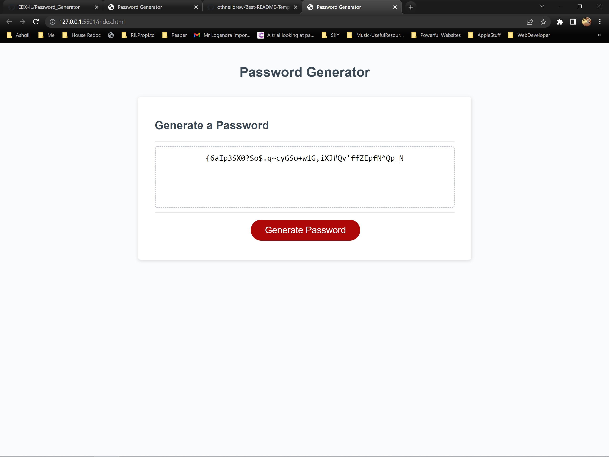

# Password_Generator

# Table of contents

- [Overview](#overview)
  - [The challenge](#the-challenge)
  - [Screenshot](#screenshot)
  - [Links](#links)
- [My process](#my-process)
  - [Built with](#built-with)
  - [What I learned](#what-i-learned)
  - [Continued development](#continued-development)
  - [Useful resources](#useful-resources)
- [Author](#author)
- [Acknowledgments](#acknowledgments)


## Overview

### The challenge

The challenge required me to create an application that an employee can use to generate a random password based on criteria they’ve selected by modifying starter code. This app runs in the browser, features dynamically updated HTML and CSS powered by JavaScript. It has a clean and polished user interface that is responsive, and adapts to multiple screen sizes.

The apps generates a password when the "Generate Password" button is clicked by
  * Asking the user for the length of password they require
      * The length is at least 10 characters but no more than 64.
      * It also checks for input that isn't expected and re-asks the question
    * The user is then asked which of the following they want in their password
      * Lowercase
      * Uppercase
      * Numeric
      * Special characters ($@%&*, etc)
  * If the user doesn't select any they are asked again for their input
  * Once the user prompts are answered the password generated is displayed on the page.


### Screenshot

The following image shows the web application's appearance and functionality:




### Links

- Solution URL: [Password Generator on GitHub](https://github.com/EDX-IL/Password_Generator.git)
- Live Site URL: [Live Password Generator](https://edx-il.github.io/Password_Generator/)

## My process

### Built with

- Semantic HTML5 markup
- CSS custom properties
- Javascript
- Mobile-first workflow


### What I learned

- Validating User Inputs (prompt and confirm)
- Array Methods
- Returning values from Functions
- Javascript Objects
- Scope of Variables


To see how you can add code snippets, see below:


```js
// Function for getting a random element from an array
function getRandom(arr) {
  // Generate random number between 0 and array length-1
  // This is achieved by math.random gives a number between 0 and 1. multiply by array length
  return  ( arr.at(Math.floor(Math.random()*(arr.length)))) ;
}

```

```js
//This loops if input isn't between 10 and 64 and handles not number entries
do {
     pwdLen = Number(window.prompt("How many Characters do you want your password to be ? 10-64 "));
     
    } while ((pwdLen <10) || (pwdLen>64) || isNaN(pwdLen) );
 
```


### Continued development

Better User Experience: So that if the user is continually entering the wrong information to the prompts more targetted feedback and instructions can be given


### Useful resources

- [MDN Web Docs - Array ](https://developer.mozilla.org/en-US/docs/Web/JavaScript/Reference/Global_Objects/Array#instance_methods) - This helped me understand array methods. I will use it going forward.
- [W3Schools - Do While](https://www.w3schools.com/jsref/jsref_dowhile.asp) - This  article which helped me understand do while loop and conditions. I'd recommend it to anyone still learning this concept.


## Author
  Ian Logendra

- GitHub - [EDX-IL](https://github.com/EDX-IL)


## Acknowledgments

- Emilie  Godin who i worked with in the breakout rooms
- Noah Camara (TA) who has been very supportive
- Andrew Layendecker who helped with the challenge in the homework session breakout room
- Scott Nelson for the READ.ME template which i've used. It's something i've not done well on to date. Finally i think this might be the way forward!
- Dane Edwards - Class Instructor 